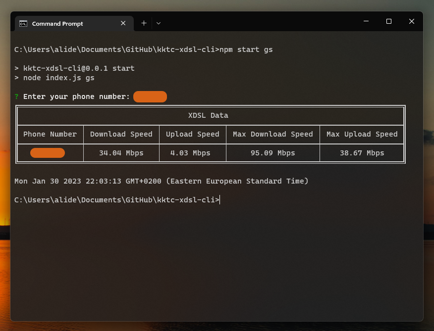

# KKTC XDSL-Cli



## Description

KKTC XDSL-Cli is a command line tool for Fetching xdsl data from North Cyprus Telecommunications Department and display it in a table format.

## Installation

```
$ npm install
```

## Usage
    
```
$ npm start
```

## Available Commands

```
$ npm start help // Shows help menu
$ npm start get-speed || gs // Fetches xdsl data and displays it in a table format
```